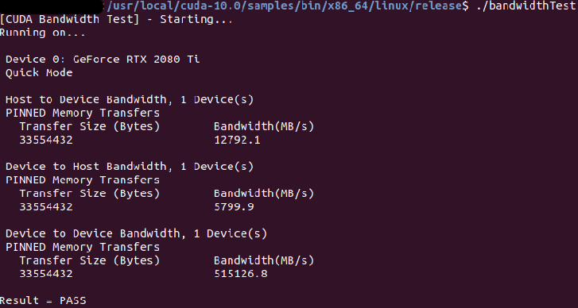
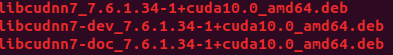
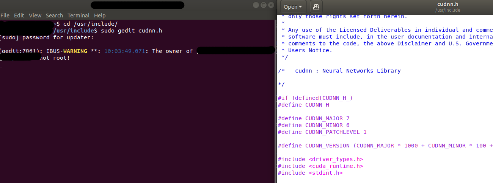

Make GPU Environment with 2080ti SLI : Tensorflow and Keras
---
***
##### Operating System : Linux Ubuntu 18.04
##### GPU : RTX-2080Ti (x2, SLI)
##### Tensorflow Version : 1.13.1
##### Keras Version : 2.1.2
##### CUDA Version : 10.0.0
***

환경 구성 과정(리눅스 터미널의 복사 : Ctrl + Ins, 붙여넣기 : Shift + Ins)

1 . 최신 그래픽드라이버 설치(이 방법은 CUDA 9.2 이상에 대한 방법)

- $ sudo add-apt-repository ppa:graphics-drivers/ppa
- $ sudo apt update
- $ sudo ubuntu-drivers autoinstall
- $ sudo reboot
- $ sudo apt install nvidia-cuda-toolkit gcc-6

여기까지 완료가 되면 nvidia-smi를 입력하여 그래픽 드라이버가 설치되었는지 확인해준다.

- $ nvidia-smi

2 . CUDA 10.0 다운받기

그 다음 NVIDIA CUDA를 다운받아준다. 해당 글을 작성할때는 CUDA 10.0.0버전을 다운로드 하기 때문에 10.0.0에 대한 링크를 걸지만, 자신이 만약 다른 버전의 CUDA를 사용해야한다면, Cuda Toolkit Archive로 들어가서 버전을 맞춰주면 된다.

[CUDA 10.0.0 링크](https://developer.nvidia.com/cuda-10.0-download-archive)
[CUDA Archive](https://developer.nvidia.com/cuda-toolkit-archive)

CUDA를 다운로드 받을때에는 자신의 운영체제에 맞게끔 설정을 해주고 다운로드 해주어야 한다. 해당 글에서는 Ubuntu 18.04버전에 맞게끔 설정을 하여 다운로드 해주었다.다운로드는 아래 사진과 같이 자신의 환경을 맞춰주고 난 후 나오는 다운로드 버튼을 눌러주면 된다.
 
Download 디렉토리에 다음과 같이 파일이 다운로드된것을 볼 수 있다.
 
터미널에 들어가서 Download 디렉토리로 들어가자.
 

우리가 CUDA파일을 다운로드 받을때 Base Installer 이라고 되어있는 부분이 있을것이다.

Download디렉토리로 이동된 상태에서 Base Installer 부분을 순서대로 다운로드 해주면된다.

 - $ sudo dpkg -i cuda (CUDA파일 이름)
 - $ sudo apt-key add /var/cuda-repo-< version >/(뒤에 있는 부분)

여기서 말하는 < version >부분이 의미하는것은 파일 이름 전체 부분에서 이 부분까지만 해당된다.(위의 cuda-repo이름과 비교해 보면서 보기)

 - $ sudo apt-get update
 - $ sudo apt-get install cuda

 여기까지 설치한 후에는 bashrc에 환경변수 설정을 해주어야 한다.

 - $ gedit ~/.bashrc

 bashrc에 들어왔다면 맨 아래에 이 두줄을 입력해준다.

 - export PATH=/usr/local/cuda-10.0/bin${PATH:+:${PATH}}
 - export LD_LIBRARY_PATH=/usr/local/cuda-10.0/lib64${LD_LIBRARY_PATH:+:${LD_LIBRARY_PATH}}

그 후 재부팅을 해준다.

 - $ reboot

3 . CUDA설치 확인 및 테스트

리부팅이 된 후 쿠다가 잘 설치되었는지 확인해 주어야한다.

 - $ cat /proc/driver/nvidia/version
 - $ nvcc -V

여기서 자신이 설치하고자 하였던 버전이 나온다면 잘 설치가 된것이다.

자신이 원하는 CUDA가 잘 설치되었다면 테스트를 해보자.

 - $ cd /usr/local/cuda-10.0/samples

여기서 10.0에는 자신의 CUDA버전을 써주면된다.(10.대 버전은 위의 명령어대로)(이 과정이 꽤 오래걸린다. 약 10분)

 - $ sudo make
 - $ cd bin/x86_64/linux/release

두가지의 테스트를 해볼것이다. deviceQuery와 bandwithTest를 해볼것이다. 우선 deviceQuery이다.
 - $ ./deviceQuery

잘 설치가 되었다면 맨 마지막에 있는 Result라는 부분이 Result=PASS라고 떠야한다.

이번에는 bandwithTest를 해보자.
- $ ./bandwidthTest
bandwithTest도 동일하게 마지막 Reuslt부분이 Result=PASS라고 되어야만 잘 설치가 된것이다.

여기까지 문제 없이 잘 되었다면 CUDA는 잘 설치가 된것이다. 이제 CUDNN을 설치하자.

4 . CUDNN 설치하기

CUDNN을 설치하기 위해서는 밑에 링크에서 다운로드 받으면 된다. 다운로드를 위해서는 회원가입이 필요하다.

[CUDNN 다운로드 링크](https://developer.nvidia.com/cudnn)

로그인까지 다 한 후 메인페이지에서 보이는 다음 부분을 들어가면된다.

들어가면 다음과 같이 선택지가 나오는데 **꼭 자신의 CUDA버전과 동일한 cuDNN을 설치해 주어야한다**

그 후 자신의 운영체제와 버전이 동일한 아래의 3개(Runtime Library, Developer Library, Code Samples and User Guide)를 다운로드 해주면 된다.

3개 모두 다운로드 후 과정도 위에서 CUDA를 설치했던 과정과 동일하게 터미널에서 Download 디렉토리로 이동 후 진행한다($ cd Downloads).
터미널 디렉토리 이동 후 ls로 파일들을 살펴보면 다음과 같이 3가지 파일이 생성된걸 볼 수 있을것이다.

그 후 과정을 다음과 같다.

 - $ sudo dpkg -i libcudnn7_7.5.0.56-1+cuda10.0_amd64.deb
 - $ sudo dpkg -i libcudnn7-dev_7.5.0.56-1+cuda10.0_amd64.deb
 - $ sudo dpkg -i libcudnn7-doc_7.5.0.56-1+cuda10.0_amd64.deb

물론 여기서 -i 이후의 부분은 자신이 다운로드한 파일의 파일명을 넣어주어야 한다.

여기까지 하면 cuDNN설치가 완료되게 된다. cuDNN테스트의 방법은 다음과 같다.

  - $ cd /usr/src/cudnn_samples_v7/mnistCUDNN/
  - $ sudo make clean && sudo make
  - $ ./mnistCUDNN

./mnistCUDNN 부분에서 오류가 날 수도 있다.그 경우에는 cudnn.h 파일을 변경해줌으로서 해결이 가능하다.다음 과정을 그대로 따라하면 된다.

 - $ cd /usr/include/
 - $ sudo gedit cudnn.h

그럼 헤더파일 코드가 나오게 되는데, 전처리기 부분 중 "driver_types.h" 라고 되어있는 부분을  < driver_types.h >로 바꿔주면 된다.

그 후 테스트 과정을 다시 해보면 오류없이 잘 실행될 것이다.
